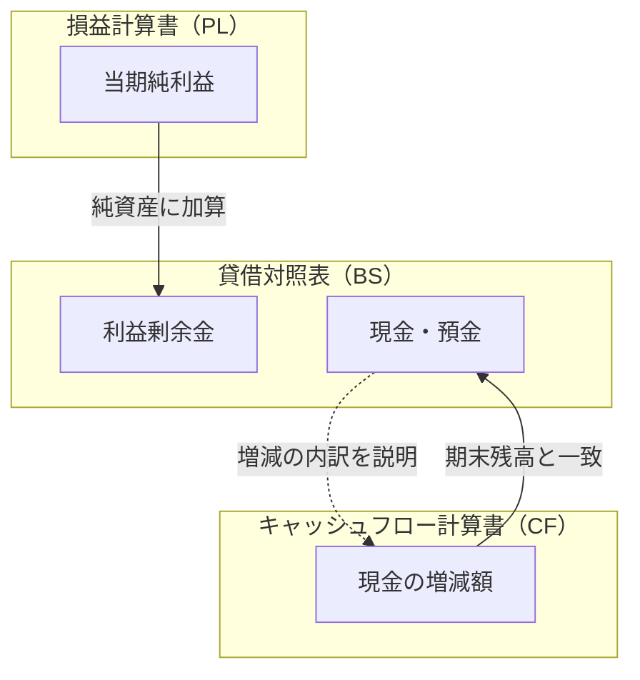

# 4. 財務諸表の読み方 | Understanding Financial Statements

Yusuke Izumi, CFA 著

> **「財務諸表が読めなければ、経営会議では沈黙するしかない。」**
>
> **「BS・PL・CF の3つが読めれば、企業の過去・現在・未来が見えてくる。」**

## はじめに | Introduction

Chapter 1〜3 で、お金の時間的価値、金利とリスク、投資判断の技法（NPV・IRR・Payback Period）を学びました。

Chapter 4〜7では、 **財務諸表（Financial Statements）** を正しく読み解く力を身に付けていきましょう。

CTO やエンジニアリング・マネージャーとして、あなたは次のような場面に遭遇します：

> **「このスタートアップに出資すべきか？財務状況を評価してほしい。」**
>
> **「当社の技術投資が財務にどう影響しているか、取締役会で説明できるか？」**
>
> **「競合他社の決算が発表された。何を読み取るべきか？」**

この章では、財務諸表の基本構造と、それらがどのように連携しているかを学びます：

1. **財務諸表の役割** — なぜ3つの財務諸表が必要なのか
2. **発生主義会計** — 財務諸表を理解するための最重要原則
3. **会計基準** — 日本基準と IFRS の違いを理解する
4. **3つの財務諸表** — BS・PL・CF それぞれの役割と読み方
5. **財務諸表の連携** — 3つの表がどう繋がっているか
6. **財務諸表分析の視点** — 誰に伝えるかで分析は変わる

---

## 4.1. 財務諸表の役割 | The Role of Financial Statements

### 財務諸表とは何か

**財務諸表（Financial Statements）** とは、企業の財政状態と経営成績を報告するための公式な書類です。

主要な財務諸表は **3つ** あります：

| 財務諸表                         | 英語名                    | 何を表すか                                 | 時間軸     |
| :------------------------------- | :------------------------ | :----------------------------------------- | :--------- |
| **貸借対照表（BS）**             | Balance Sheet             | 財政状態（何を持ち、何を負っているか）     | ある一時点 |
| **損益計算書（PL）**             | Profit and Loss Statement | 経営成績（いくら稼ぎ、いくら使ったか）     | 一定期間   |
| **キャッシュフロー計算書（CF）** | Cash Flow Statement       | 現金の動き（どこから来て、どこへ行ったか） | 一定期間   |

> **📖 Example: 財務諸表を「健康診断」に例えると**
>
> - **BS（貸借対照表）** = 身体測定の結果（身長、体重、体脂肪率など、ある時点の状態）
> - **PL（損益計算書）** = 食事と運動の記録（摂取カロリーと消費カロリー、一定期間の活動）
> - **CF（キャッシュフロー計算書）** = 血液検査（実際に体内を流れている血液の状態）
>
> 健康診断では、一つの検査だけでは全体像が分かりません。同様に、企業分析でも3つの財務諸表を組み合わせて見ることが重要です。

---

### なぜ3つの財務諸表が必要なのか

一つの財務諸表だけでは、企業の実態を正確に把握できません。

> **📖 Example: PL だけでは見えない「落とし穴」**
>
> SaaS スタートアップ A 社の損益計算書：
>
> | 項目       |          金額 |
> | :--------- | ------------: |
> | 売上高     |         1億円 |
> | 費用       |     8,000万円 |
> | **純利益** | **2,000万円** |
>
> 「黒字で順調だ！」と思うかもしれません。
>
> しかし、キャッシュフロー計算書を見ると：
>
> | 項目                 |       金額 |
> | :------------------- | ---------: |
> | 営業キャッシュフロー | △3,000万円 |
>
> 現金が流出しています。なぜでしょうか？
>
> 貸借対照表の変化を見ると：
>
> | 項目   |      期首 |      期末 |       変化 |
> | :----- | --------: | --------: | ---------: |
> | 売掛金 | 2,000万円 | 7,000万円 | +5,000万円 |
>
> **原因：** 売上は計上されているが、顧客からの入金が遅れている（売掛金が増加）。
>
> **結論：** PL は黒字でも、現金が回収できなければ資金繰りに窮します。3つの財務諸表を見ることで、初めて全体像が把握できるのです。

---

## 4.2. 発生主義会計 | Accrual Basis Accounting

### 財務諸表を理解するための最重要原則

財務諸表を正しく読むために、 **発生主義会計（Accrual Basis Accounting）** という原則を理解する必要があります。

**発生主義会計とは：**

現金の動きに関係なく、 **経済的な取引が発生した時点** で収益・費用を認識する会計方式です。

| 方式         | 収益の認識           | 費用の認識         |
| :----------- | :------------------- | :----------------- |
| **現金主義** | 現金を受け取ったとき | 現金を支払ったとき |
| **発生主義** | 収益が発生したとき   | 費用が発生したとき |

> **📖 Example: SaaS の年間契約**
>
> 顧客が年間契約（120万円）を4月1日に全額前払いしました。
>
> **現金主義の場合：**
>
> - 4月：売上 120万円
> - 5月〜翌3月：売上 0円
>
> **発生主義の場合：**
>
> - 4月〜翌3月：毎月 売上 10万円
>
> 発生主義では、サービスを提供した期間に応じて売上を認識します。前払いで受け取った120万円のうち、まだサービス未提供の分は **前受収益（負債）** として BS に計上されます。

---

### 認識と実現の分離

発生主義の核心は、 **認識（Recognition）** と **実現（Realization）** の分離です。

| 概念     | 意味                   | 例             |
| :------- | :--------------------- | :------------- |
| **認識** | 会計帳簿に記録すること | 売上を計上する |
| **実現** | 現金が実際に動くこと   | 代金を受け取る |

この分離があるからこそ、 **PL（利益）と CF（現金）が一致しない** のです。

> **📖 Example: BtoB SaaS の売掛取引**
>
> 4月にサービスを提供し、請求書を発行。支払期限は5月末。
>
> | タイミング          | PL への影響   | CF への影響   | BS への影響                    |
> | :------------------ | :------------ | :------------ | :----------------------------- |
> | 4月（サービス提供） | 売上 +100万円 | なし          | 売掛金 +100万円                |
> | 5月（入金）         | なし          | 現金 +100万円 | 売掛金 △100万円、現金 +100万円 |
>
> 4月時点で売上は **認識** されますが、現金は **実現** していません。この差が売掛金として BS に表れます。

---

### 費用収益対応の原則

発生主義のもう一つの重要な原則が **費用収益対応の原則（Matching Principle）** です。

**原則：** 収益を生み出すために発生した費用は、その収益と同じ期間に計上する。

> **📖 Example: サーバー購入と減価償却**
>
> 4月1日にサーバー（600万円、耐用年数5年）を購入しました。
>
> **現金主義的な考え方：**
>
> - 4月：費用 600万円
>
> **発生主義（費用収益対応）：**
>
> - 毎年：減価償却費 120万円（600万円 ÷ 5年）
>
> サーバーは5年間にわたって収益獲得に貢献します。したがって、費用も5年間に配分するのが合理的です。

---

## 4.3. 会計基準 | Accounting Standards

### 会計基準とは何か

**会計基準（Accounting Standards）** とは、財務諸表を作成する際のルールブックです。

同じ経済取引でも、適用する会計基準によって財務諸表の数値が異なることがあります。企業の財務諸表を読む際には、 **どの会計基準で作成されているか** を確認することが重要です。

### 主要な会計基準

日本で使用される主な会計基準は以下の3つです：

| 会計基準                | 正式名称                                                        | 主な適用企業                 |
| :---------------------- | :-------------------------------------------------------------- | :--------------------------- |
| **日本基準（J-GAAP）**  | 企業会計基準                                                    | 多くの日本企業               |
| **IFRS**                | International Financial Reporting Standards（国際財務報告基準） | グローバル展開する大企業     |
| **米国基準（US-GAAP）** | Generally Accepted Accounting Principles                        | 米国上場企業、一部の日本企業 |

> **📖 Example: 日本のテック企業の会計基準選択**
>
> | 企業名   | 適用会計基準 | 選択理由                                   |
> | :------- | :----------- | :----------------------------------------- |
> | Freee    | 日本基準     | 国内市場中心、上場基準として十分           |
> | メルカリ | IFRS         | グローバル展開、海外投資家へのアピール     |
> | ソニー   | 米国基準     | 歴史的に米国市場での資金調達を重視         |
> | トヨタ   | IFRS         | 2021年より移行、グローバル比較可能性を重視 |

---

### 日本基準と IFRS の主な違い

日本基準と IFRS では、いくつかの重要な会計処理が異なります。CTO や技術リーダーが知っておくべき主な違いを解説します。

#### 1. のれん（Goodwill）の処理

**のれん** とは、M&A で支払った金額が、取得した純資産の公正価値を超える部分です。「買収プレミアム」とも呼ばれます。

| 項目            | 日本基準               | IFRS                               |
| :-------------- | :--------------------- | :--------------------------------- |
| **償却**        | 20年以内で規則的に償却 | 償却しない                         |
| **減損**        | 必要に応じて減損テスト | 毎年減損テストを実施               |
| **PL への影響** | 毎期の利益を減少させる | 減損が発生しない限り利益に影響なし |

> **📖 Example: M&A と「のれん」の影響**
>
> SaaS 企業 A 社が、スタートアップ B 社を100億円で買収。B 社の純資産の公正価値は40億円。
>
> → のれん = 100億円 − 40億円 = **60億円**
>
> **日本基準の場合（10年償却と仮定）：**
>
> - 毎年 6億円 ののれん償却費が PL に計上される
> - 利益が毎年 6億円 減少する
>
> **IFRS の場合：**
>
> - 償却なし → 通常は利益に影響なし
> - ただし、B 社の業績が悪化すれば、一括で減損損失を計上するリスクあり
>
> **結論：** 同じ M&A でも、会計基準によって報告される利益が大きく異なります。

---

#### 2. リース会計

2019年に IFRS 16 が導入され、リース会計の処理が大きく変わりました。日本基準も2027年から新基準が適用予定です。

| 項目                       | 従来の日本基準             | IFRS 16（新基準）                        |
| :------------------------- | :------------------------- | :--------------------------------------- |
| **オペレーティングリース** | 賃貸借処理（オフバランス） | 原則として資産・負債計上（オンバランス） |
| **BS への影響**            | 資産・負債に計上されない   | 使用権資産と負債が計上される             |
| **財務指標への影響**       | 負債比率に影響なし         | 負債比率が上昇する可能性                 |

> **📖 Example: オフィス賃貸のリース会計**
>
> SaaS 企業が年間賃料 1億円、契約期間 5年 のオフィスを賃借した場合：
>
> **従来の日本基準：**
>
> - BS：変化なし（オフバランス）
> - PL：毎年 1億円 の賃貸費用を計上
>
> **IFRS 16：**
>
> - BS：使用権資産 約4.5億円、リース負債 約4.5億円 を計上（割引現在価値）
> - PL：減価償却費 + 利息費用 を計上
>
> **CTO が知っておくべきポイント：**
>
> - データセンター、オフィス、社用車などのリース契約が多い企業は、IFRS 適用で負債が大きく増加する可能性がある
> - 財務指標（負債比率など）の変化に注意が必要

---

#### 3. 研究開発費（R&D）

テック企業にとって最も重要な違いの一つです。

| 項目                     | 日本基準                   | IFRS                           |
| :----------------------- | :------------------------- | :----------------------------- |
| **研究費**               | 発生時に費用処理           | 発生時に費用処理               |
| **開発費**               | 原則として発生時に費用処理 | 一定要件を満たせば資産計上可能 |
| **自社開発ソフトウェア** | 一定要件で資産計上可能     | 開発段階の支出は資産計上可能   |

> **📖 Example: 自社プロダクト開発費用の処理**
>
> SaaS 企業が新機能開発に年間 3億円 を投資した場合：
>
> **日本基準（費用処理の場合）：**
>
> - PL：研究開発費 3億円 → 営業利益が 3億円 減少
> - BS：影響なし
>
> **IFRS（資産計上の場合）：**
>
> - BS：無形資産（開発費）3億円 を計上
> - PL：減価償却を通じて数年にわたり費用化
>
> **重要：** IFRS では開発費を資産計上できる場合がありますが、これは「会計上の利益が増える」だけであり、現金支出（投資 CF）は同じです。

---

### 会計基準の違いが分析に与える影響

会計基準が異なる企業を比較する際には、以下の点に注意が必要です：

| 比較項目      | 注意点                                                 |
| :------------ | :----------------------------------------------------- |
| **営業利益**  | のれん償却の有無、R&D の処理方法で大きく異なる可能性   |
| **負債比率**  | リースのオンバランス化で IFRS 適用企業は高くなりやすい |
| **ROA / ROE** | 資産・純資産の計上方法の違いが影響                     |
| **EBITDA**    | 会計基準の違いを調整するためによく使われる指標         |

> **📖 Example: なぜ EBITDA が使われるのか**
>
> **EBITDA**（Earnings Before Interest, Taxes, Depreciation, and Amortization）は、以下を加算調整することで、会計基準の違いを軽減します：
>
> - 減価償却費（Depreciation）
> - のれん償却費（Amortization）
>
> 異なる会計基準を適用する企業間で収益力を比較する際に、EBITDA がよく用いられる理由です。

---

## 4.4. 貸借対照表（BS） | Balance Sheet

### BS の基本構造

**貸借対照表（Balance Sheet）** は、 **ある一時点** における企業の財政状態を示します。

BS には必ず **基準日** が明記されます。例えば「2025年12月31日現在」や「2025年6月30日現在」のように、その日時点での財政状態を表します。これは写真のスナップショットのようなもので、その瞬間の資産・負債・純資産の状態を切り取ったものです。

また、実務上の BS は **前年との比較形式** で表示されることが一般的です。これにより、1年間で資産や負債がどのように変化したかを把握できます。

左側（借方）に **資産** 、右側（貸方）に **負債** と **純資産** が並び、必ず以下の等式が成り立ちます：

$$
資産 = 負債 + 純資産
$$

**【資産の部】**

| 勘定科目                       | 2024年12月31日 | 2025年12月31日 |
| :----------------------------- | -------------: | -------------: |
| **流動資産**                   |                |                |
| 　現金・預金                   |         40億円 |         50億円 |
| 　売掛金                       |          8億円 |         10億円 |
| 　棚卸資産                     |          2億円 |          2億円 |
| **固定資産**                   |                |                |
| 　有形固定資産（サーバー等）   |         10億円 |          8億円 |
| 　無形固定資産（ソフトウェア） |         20億円 |         30億円 |
| **資産合計**                   |     **80億円** |    **100億円** |

**【負債の部・純資産の部】**

| 勘定科目                 | 2024年12月31日 | 2025年12月31日 |
| :----------------------- | -------------: | -------------: |
| **流動負債**             |                |                |
| 　買掛金                 |          4億円 |          5億円 |
| 　短期借入金             |          5億円 |         10億円 |
| 　前受収益               |         15億円 |         20億円 |
| **固定負債**             |                |                |
| 　長期借入金             |         16億円 |         15億円 |
| **負債合計**             |     **40億円** |     **50億円** |
| **【純資産の部】**       |                |                |
| 　資本金                 |         30億円 |         30億円 |
| 　利益剰余金 ← PL と連動 |         10億円 |         20億円 |
| **純資産合計**           |     **40億円** |     **50億円** |
| **負債・純資産合計**     |     **80億円** |    **100億円** |

※ 資産合計と負債・純資産合計は必ず一致します（2025年：100億円 = 50億円 + 50億円）

---

### BS の読み方：SaaS 企業の例

> **📖 Example: フリー株式会社の連結貸借対照表（2024年6月期 → 2025年6月期）**
>
> | 資産           | 2024年6月末 | 2025年6月末 |
> | :------------- | ----------: | ----------: |
> | 現金及び預金   |     318億円 |     358億円 |
> | 売掛金         |      27億円 |      36億円 |
> | 立替金         |      23億円 |      40億円 |
> | その他流動資産 |      17億円 |      25億円 |
> | 固定資産       |      15億円 |      67億円 |
> | **資産合計**   | **400億円** | **526億円** |
>
> | 負債・純資産         | 2024年6月末 | 2025年6月末 |
> | :------------------- | ----------: | ----------: |
> | 短期借入金           |      47億円 |      96億円 |
> | **前受収益**         | **114億円** | **147億円** |
> | その他流動負債       |      53億円 |      70億円 |
> | 固定負債             |      16億円 |      16億円 |
> | **負債合計**         | **230億円** | **329億円** |
> | **純資産合計**       | **170億円** | **197億円** |
> | **負債・純資産合計** | **400億円** | **526億円** |
>
> （出典：フリー株式会社 2025年6月期 決算短信より作成）
>
> **SaaS 企業の BS で注目すべきポイント：**
>
> 1. **現金及び預金（+40億円）** — 営業 CF の黒字化により現金が増加
> 2. **前受収益（+33億円）** — SaaS の年間契約増加を反映。将来の売上が確定している金額
> 3. **固定資産（+52億円）** — ソフトウェア資産の計上開始（会計方針変更）と M&A によるのれん
> 4. **短期借入金（+49億円）** — 成長投資のための資金調達
> 5. **純資産（+27億円）** — 初の営業黒字（当期純利益 14億円）と新株発行による増加
>
> **結論：**
>
> このように BS を前年比較で分析することで、フリー株式会社が「赤字のスタートアップ」から「黒字化を達成した成長企業」へと転換しつつあることが読み取れます。総資産は 400億円から 526億円へと拡大し、その成長資金は借入金の増加（+49億円）によって賄われています。ソフトウェアが資産化されることで、開発費が当期の費用となって利益を下げずに済むため、より大胆に開発に投資することも可能になったと伺えます。前受収益が 114億円から 147億円へと積み上がっていることは、SaaS ビジネスの根幹である「将来の売上の可視化」が順調に進んでいることを示しています。そして純資産の増加は、ついに黒字化を達成し、利益が蓄積され始めたことの証左です。

### BS から読み取れること

一般に、BS を分析することで企業の様々な側面が見えてきます。まず、総資産の大きさとその増減から、企業規模と成長スピードを把握できます。次に、負債と純資産のバランス（自己資本比率）を見ることで、財務の健全性を評価できます。借入金が多いのか、株主からの出資が多いのかという資金調達の戦略も、BS の構成から読み取れます。

また、資産の構成からはビジネスモデルの特徴が浮かび上がります。現金が多い企業、固定資産が多い企業、売掛金が多い企業では、それぞれ事業の性質が異なります。SaaS 企業であれば前受収益、製造業であれば棚卸資産など、業種特有の項目に注目することで、将来の収益性を推測することもできます。

BS は「ある時点での企業の姿」を映し出すスナップショットです。PL が「どれだけ稼いだか」を示すのに対し、BS は「何を持ち、何を負っているか」という企業の財務体質そのものを表しています。BS を使った具体的な財務分析の手法（自己資本比率、流動比率など）については、Chapter 6 で詳しく解説します。

---

## 4.5. 損益計算書（PL） | Profit and Loss Statement

### PL の基本構造

**損益計算書（Profit and Loss Statement）** は、 **一定期間** の経営成績を示します。

| 項目                                     |    金額 |
| :--------------------------------------- | ------: |
| 売上高                                   |   1,000 |
| － 売上原価                              |     200 |
| **売上総利益（粗利）**                   | **800** |
| － 販売費及び一般管理費（販管費）        |     600 |
| 　（人件費、広告宣伝費、減価償却費など） |         |
| **営業利益**                             | **200** |
| ＋ 営業外収益                            |      10 |
| － 営業外費用（支払利息など）            |      30 |
| **経常利益**                             | **180** |
| ＋ 特別利益                              |       0 |
| － 特別損失                              |      20 |
| **税引前当期純利益**                     | **160** |
| － 法人税等                              |      50 |
| **当期純利益**                           | **110** |

PL は上から下へ、売上から費用を順番に差し引いていく構造になっています。

まず **売上高** は、企業が本業で得た収益の総額です。SaaS 企業であればサブスクリプション収入、受託開発企業であればプロジェクト収入がここに計上されます。

**売上原価** は、売上を生み出すために直接かかった費用です。製造業であれば原材料費や外注費用、ECであればサプライヤーへの支払いなどがそれにあたります。売上高から売上原価を引いたものが **売上総利益（粗利）** であり、これは商品やサービスの付加価値を表します。

**販売費及び一般管理費（販管費）** は、商品を売るためにかかる費用（営業人件費、広告宣伝費）と、会社を運営するための費用（管理部門の人件費、オフィス賃料、減価償却費）の合計です。売上総利益から販管費を引いたものが **営業利益** であり、これが本業で稼いだ利益を示します。

**営業外収益・営業外費用** は、本業以外の財務活動による損益です。受取利息や受取配当金は営業外収益に、支払利息や為替差損は営業外費用に計上されます。営業利益にこれらを加減したものが **経常利益** です。

**特別利益・特別損失** は、臨時的・例外的に発生した損益です。固定資産の売却益、投資有価証券の評価損、災害による損失などが該当します。経常利益にこれらを加減し、法人税等を差し引いたものが **当期純利益** となり、これが最終的に株主に帰属する利益です。

---

### PL の読み方：利益の段階を理解する

PL には複数の「利益」があります。それぞれの意味を理解しましょう。

| 利益の種類     | 何を表すか           | 注目ポイント                        |
| :------------- | :------------------- | :---------------------------------- |
| **売上総利益** | 本業の付加価値       | SaaS は 70〜80% が目安              |
| **営業利益**   | 本業の稼ぐ力         | 事業の収益性を示す                  |
| **経常利益**   | 通常の企業活動の成果 | 財務活動を含む                      |
| **当期純利益** | 最終的な利益         | BS の純資産に余剰金として加算される |

### 非 GAAP 指標：EBIT・EBITDA・調整後営業利益

上記の利益指標は会計基準（GAAP）に基づくものですが、実務では **非 GAAP 指標** もよく使われます。これらは会計基準の違いや非現金費用の影響を取り除き、企業間比較や本質的な収益力の評価を容易にするための指標です。

**EBIT（Earnings Before Interest and Taxes）** は、利払い前・税引前利益です。日本の営業利益に近い概念ですが、厳密には営業外収益・費用のうち支払利息以外の項目を含む場合があります。資本構成（負債と株主資本の比率）の影響を除いた事業の収益力を見るのに適しています。

**EBITDA（Earnings Before Interest, Taxes, Depreciation and Amortization）** は、EBIT に減価償却費とのれん償却費を加算したものです。設備投資の多寡や会計基準の違い（のれん償却の有無など）に左右されにくいため、異なる業種や国の企業を比較する際によく用いられます。また、簡易的なキャッシュ創出力の指標としても使われます。M&A の企業価値評価では EV/EBITDA 倍率が標準的な指標の一つです。

**調整後営業利益** は、企業が独自に定義する非 GAAP 指標です。フリー株式会社の場合、営業利益に株式報酬費用と M&A により生じた無形資産の償却費用を加算して算出しています。株式報酬費用は現金支出を伴わない費用であり、これを加算することで「現金ベースでの収益力」を示す狙いがあります。成長企業では株式報酬を多用するため、この調整は特に重要です。

> **📖 Example: フリー株式会社の共通サイズ分析（2025年6月期）**
>
> 売上高を 100% として、各項目の割合を見ます：
>
> | 項目           |        金額 |  売上高比 |
> | :------------- | ----------: | --------: |
> | 売上高         |     333億円 |    100.0% |
> | 売上原価       |      59億円 |     17.8% |
> | **売上総利益** | **274億円** | **82.2%** |
> | 販管費         |     268億円 |     80.4% |
> | **営業利益**   |   **6億円** |  **1.8%** |
>
> （出典：フリー株式会社 2025年6月期 決算短信より作成）
>
> **読み取れること：**
>
> - 売上総利益率 82% は SaaS 企業として健全な水準
> - 2025年6月期に初の営業黒字（6億円）を達成
> - 前年は営業損失 84億円だったため、大幅な収益改善
> - 販管費率が 80% と高いが、これは SaaS の成長投資フェーズでは一般的

### PL から読み取れること

PL を段階的に分析することで、企業の「稼ぐ力」がどこにあるのかを見極めることができます。

たとえば、当期純利益が大きく出ていても、その内訳を見ると営業利益は減少しており、特別利益（資産売却益など）で補っているだけかもしれません。これは本業の稼ぐ力が衰えていることを意味し、持続可能な成長とは言えません。逆に、当期純利益が減少していても、それが特別損失（災害損失や減損など）による一時的なものであれば、本業の収益力は健全である可能性があります。

また、売上総利益率が高くても営業利益率が低い場合は、販管費（人件費や広告宣伝費）が膨らんでいることを示します。成長投資フェーズでは許容されますが、売上成長が鈍化しても販管費率が下がらなければ問題です。営業利益は黒字でも経常利益が赤字であれば、支払利息などの財務負担が重いことが分かります。

このように、最終的な当期純利益だけでなく、各段階の利益を比較することで、企業の強みと弱み、そして利益の「質」を評価することができます。PL を使った具体的な収益性分析（売上総利益率、営業利益率など）については、Chapter 5 で詳しく解説します。

---

## 4.6. キャッシュフロー計算書（CF） | Cash Flow Statement

### CF の基本構造

**キャッシュフロー計算書（Cash Flow Statement）** は、 **一定期間** の現金の動きを示します。

キャッシュフローは **3つの活動** に分類されます：

| 活動区分        | 内容                       | 例                               |
| :-------------- | :------------------------- | :------------------------------- |
| **営業活動 CF** | 本業による現金の出入り     | 売上の入金、仕入の支払い、人件費 |
| **投資活動 CF** | 投資による現金の出入り     | 設備投資、M&A、有価証券の売買    |
| **財務活動 CF** | 資金調達による現金の出入り | 借入、返済、増資、配当           |

> **📖 Example: フリー株式会社の連結キャッシュフロー計算書（2025年6月期）**
>
> | 区分               | 項目                              | 金額（億円） |
> | :----------------- | :-------------------------------- | -----------: |
> | **Ⅰ. 営業活動 CF** | 税引前当期純利益                  |            4 |
> |                    | ＋ 減価償却費（非現金費用を加算） |            3 |
> |                    | ＋ 株式報酬費用（非現金費用）     |           10 |
> |                    | － 売掛金の増加（現金未回収）     |          △10 |
> |                    | ＋ 前受収益の増加（現金先取り）   |           33 |
> |                    | その他                            |           △3 |
> |                    | **営業活動 CF 合計**              |       **37** |
> | **Ⅱ. 投資活動 CF** | 無形固定資産の取得                |          △38 |
> |                    | 子会社株式の取得                  |           △6 |
> |                    | その他                            |           △2 |
> |                    | **投資活動 CF 合計**              |      **△46** |
> | **Ⅲ. 財務活動 CF** | 短期借入金の純増                  |           49 |
> |                    | 株式発行による収入                |            1 |
> |                    | **財務活動 CF 合計**              |       **50** |
> |                    | **現金及び現金同等物の増減額**    |       **40** |
> |                    | 期首残高                          |          318 |
> |                    | **期末残高**                      |      **358** |
>
> （出典：フリー株式会社 2025年6月期 決算短信より作成）

---

### なぜ CF が重要なのか

発生主義会計では、PL の利益と実際の現金創出が一致しません。CF はこのギャップを埋める役割を果たします。

> **📖 Example: 黒字なのに現金が減る理由**
>
> | 項目         |      PL | CF への調整                           |
> | :----------- | ------: | :------------------------------------ |
> | 当期純利益   | 100万円 | 起点                                  |
> | 減価償却費   |  50万円 | ＋50万円（非現金費用）                |
> | 売掛金の増加 |       ― | △80万円（売上は計上したが現金未回収） |
> | **営業 CF**  |       ― | **70万円**                            |
> | 設備投資     |       ― | △200万円                              |
> | **CF 合計**  |       ― | **△130万円**                          |
>
> PL では100万円の黒字ですが、設備投資により現金は130万円減少しています。

---

### CF の読み方：企業のライフステージ

CF のパターンから、企業のライフステージを読み取れます：

| ステージ           | 営業 CF | 投資 CF | 財務 CF | 特徴                         |
| :----------------- | :-----: | :-----: | :-----: | :--------------------------- |
| **スタートアップ** |    △    |    △    |   ＋    | 赤字で投資中、外部資金で賄う |
| **成長期**         |   ＋    |    △    |  ＋/△   | 本業で稼ぎながら積極投資     |
| **成熟期**         |   ＋    |  △/＋   |    △    | 安定収益、借入返済・配当     |
| **衰退期**         |    △    |   ＋    |    △    | 資産売却で延命               |

> **📖 Example: フリー株式会社の CF パターン分析**
>
> **2024年6月期（前年）：**
>
> - 営業 CF：△68億円（先行投資による赤字）
> - 投資 CF：△11億円（ソフトウェア開発投資）
> - 財務 CF：＋37億円（借入による資金調達）
>
> → 典型的な「スタートアップ」のパターン
>
> **2025年6月期（当年）：**
>
> - 営業 CF：＋37億円（営業黒字化により現金創出）
> - 投資 CF：△46億円（積極的なソフトウェア投資・M&A）
> - 財務 CF：＋50億円（成長資金の借入）
>
> → **「成長期」への移行** を示すパターン。営業CFが黒字化したことで、本業から現金を生み出せる体質に変化。

### CF の作成方法：直接法と間接法

CF 計算書の作成方法には **直接法** と **間接法** の2つがあります。直接法は、現金の収入と支出を取引ごとに直接集計する方法です。一方、間接法は、PL の当期純利益を起点として、非現金項目（減価償却費など）や運転資本の増減を加減して営業 CF を算出する方法です。

日本では **間接法が主流** であり、ほとんどの上場企業が間接法を採用しています。間接法は PL との関連が明確で、「なぜ利益と現金が一致しないのか」を理解しやすいという利点があります。本章で紹介したフリー株式会社の CF 計算書も間接法で作成されています。

### CF から読み取れること

CF を分析することで、PL だけでは見えない企業の実態が浮かび上がります。

営業 CF は、本業が実際に現金を生み出しているかどうかを示します。PL で利益が出ていても、売掛金の回収が滞っていたり、在庫が積み上がっていれば、営業 CF はマイナスになります。逆に、前受収益が増加している SaaS 企業では、PL の利益以上に現金が入ってくることもあります。営業 CF が継続的にプラスであることは、企業の持続可能性を示す重要なシグナルです。

投資 CF からは、企業が将来の成長に向けてどれだけ投資しているかが分かります。成長企業は積極的に設備投資や M&A を行うため投資 CF はマイナスになりますが、衰退企業が資産を売却して延命している場合は投資 CF がプラスになります。

財務 CF は、資金調達と返済の状況を示します。成長期には借入や増資で資金を調達し（プラス）、成熟期には借入返済や配当で資金が流出します（マイナス）。

このように、営業・投資・財務の3つの CF のパターンを組み合わせることで、企業のライフステージや経営戦略を読み解くことができます。CF を使った具体的な分析手法（フリーキャッシュフロー、CF マージンなど）については、Chapter 7 で詳しく解説します。

---

## 4.7. 財務諸表の連携 | How Financial Statements Connect

### 3つの財務諸表は繋がっている

BS・PL・CF は独立した表ではなく、 **互いに連携** しています。

**具体的な連携ポイント：**

| 連携    | 説明                                                |
| :------ | :-------------------------------------------------- |
| PL → BS | 当期純利益は、BS の利益剰余金（純資産）に加算される |
| CF → BS | CF の期末現金残高は、BS の現金・預金と一致する      |
| BS → CF | BS の各項目の増減が、CF の調整項目となる            |

---

### 取引が3つの財務諸表に与える影響

具体的な取引が、各財務諸表にどう影響するかを見てみましょう。

> **📖 Example: サーバー購入から減価償却まで**
>
> **取引1：サーバー購入（600万円、現金払い）**
>
> | 財務諸表 | 影響                          |
> | :------- | :---------------------------- |
> | **BS**   | 現金 △600万、固定資産 ＋600万 |
> | **PL**   | 影響なし                      |
> | **CF**   | 投資活動 △600万               |
>
> **取引2：減価償却（年間120万円）**
>
> | 財務諸表 | 影響                                       |
> | :------- | :----------------------------------------- |
> | **BS**   | 固定資産 △120万（減価償却累計額として）    |
> | **PL**   | 減価償却費 ＋120万 → 利益 △120万           |
> | **CF**   | 営業活動で ＋120万（非現金費用の加算調整） |
>
> **ポイント：**
>
> - 購入時：現金は出ていくが、PL への影響はない（資産の形が変わっただけ）
> - 減価償却時：現金は動かないが、PL で費用が計上される
> - CF 計算書では、減価償却費を加算調整することで、PL と現金の差を調整

---

> **📖 Example: SaaS の年間契約（前受収益）**
>
> **取引1：年間契約120万円を前払いで受領（4月1日）**
>
> | 財務諸表 | 影響                                  |
> | :------- | :------------------------------------ |
> | **BS**   | 現金 ＋120万、前受収益（負債）＋120万 |
> | **PL**   | 影響なし（まだ売上は認識しない）      |
> | **CF**   | 営業活動 ＋120万                      |
>
> **取引2：月次の売上認識（毎月10万円）**
>
> | 財務諸表 | 影響                            |
> | :------- | :------------------------------ |
> | **BS**   | 前受収益 △10万                  |
> | **PL**   | 売上 ＋10万 → 利益 ＋10万       |
> | **CF**   | 影響なし（現金は4月に受領済み） |
>
> **ポイント：**
>
> - 現金を受け取った時点では売上にならない（前受収益という負債になる）
> - サービス提供に応じて、毎月売上を認識（負債が減り、売上が増える）
> - CF では、前受収益の増加は「現金を先に受け取った」ことを意味する

---

## 4.8. 財務諸表分析の視点 | Perspectives on Financial Analysis

### 誰に伝えるかで視点は変わる

財務分析の切り口は、 **誰に・何を伝えたいか** によって変わります。

| 立場               | 主な関心               | 重視する指標         | 時間軸               |
| :----------------- | :--------------------- | :------------------- | :------------------- |
| **経営者**         | 事業の成長と持続可能性 | ROI、営業利益率      | 中期的な経営目標     |
| **株式投資家**     | 将来の株価上昇         | ROE、EPS成長率       | 長期的な企業価値     |
| **債権者（銀行）** | 元本と利息の返済       | 負債比率、利払い能力 | 返済期間中の安定性   |

> **📖 Example: 技術投資の説明を相手によって変える**
>
> 新しいクラウドインフラへの移行（投資額 5億円）を提案する場合：
>
> **経営陣には：**
> 「この投資により、3年目以降のインフラコストが年間 2億円削減され、ROI は 40% を超えます。」
>
> **投資家には：**
> 「クラウドネイティブ化により開発速度が向上し、新機能リリースサイクルが 50% 短縮。これが ARR 成長率の加速につながります。」
>
> **銀行には：**
> 「コスト削減効果により、3年目以降のキャッシュフローが年間 2億円改善し、返済能力は十分に確保されます。」

---

## 4.9. 財務諸表の注記 | Footnotes to Financial Statements

### 注記事項とは何か

財務諸表には、BS・PL・CF の数値だけでなく、 **注記事項（Footnotes）** と呼ばれる補足情報が添付されています。注記事項には、財務諸表の数値だけでは読み取れない重要な情報が記載されていることがあり、財務分析においては本表と同様に注意深く読む必要があります。

### 主な注記事項の種類

| 注記の種類                   | 内容                                                   |
| :------------------------- | :--------------------------------------------------- |
| **会計方針**                 | 収益認識、減価償却方法、のれん償却期間など、会計処理の基本方針 |
| **表示方法の変更**           | 前期と異なる表示に変更した場合の説明                       |
| **セグメント情報**           | 事業セグメントごとの売上・利益                           |
| **継続企業の前提に関する注記** | 企業の存続に重大な疑義がある場合の開示                   |
| **重要な後発事象**           | 決算日後に発生した重大な事象（M&A、災害など）           |
| **1株当たり情報**           | EPS（1株当たり利益）の計算根拠                          |
| **関連当事者取引**           | 親会社・子会社・役員等との取引                           |

### 注記から読み取れる重要情報

> **📖 Example: フリー株式会社の注記事項（2025年6月期）**
>
> フリー株式会社の決算短信には、以下のような注記事項が記載されています。
>
> **1. 表示方法の変更**
>
> 2025年6月期の決算短信では、「繰延税金資産」の表示方法変更が注記されています。前期まで「投資その他の資産」の「その他」に含めていた繰延税金資産を、金額的重要性が増したため独立して表示するようになりました。
>
> | 項目         | 2024年6月期 | 2025年6月期 |
> | :----------- | ----------: | ----------: |
> | 繰延税金資産 |    8百万円  |  982百万円  |
>
> この変化は、単なる表示上の問題ではありません。 **繰延税金資産が約 120倍に増加** しているのです。これは、フリー株式会社が黒字化を達成し、過去に積み上げた税務上の繰越欠損金を将来の課税所得と相殺できる見込みが立ったことを意味します。BS 本表の数字だけを見ていては、この重要な変化を見落としてしまう可能性があります。
>
> **2. 継続企業の前提に関する注記**
>
> 「該当事項はありません」と記載されています。これは **企業の存続に重大な疑義がないこと** を意味します。もし資金繰りの悪化や債務超過などで事業継続に問題がある場合、ここに詳細な説明が記載されます。スタートアップへの投資や取引先の評価において、この注記は必ず確認すべき項目です。
>
> **3. 重要な後発事象**
>
> 「該当事項はありません」と記載されています。後発事象とは、決算日（2025年6月30日）から決算短信の発表日（2025年8月13日）までの間に発生した重要な事象です。大型 M&A の発表、重要な訴訟、自然災害による損害などがあれば、ここに開示されます。

### CTO が注記を確認すべき場面

注記事項は、特に以下のような場面で重要になります：

- **M&A のデューデリジェンス** — 買収対象企業の継続企業の前提、偶発債務、関連当事者取引をチェック
- **取引先・パートナーの信用評価** — 継続企業の前提に疑義があれば、取引リスクを再評価
- **競合分析** — セグメント情報から、どの事業が利益を生んでいるかを把握
- **投資判断** — 後発事象で重要な変化（増資、事業売却など）が開示されていないか確認

財務諸表の本表だけでなく、注記事項まで目を通すことで、企業の実態をより深く理解することができます。

---

## まとめ | Summary

**重要なポイント：**

1. **財務諸表は3つ** — BS（財政状態）、PL（経営成績）、CF（現金の動き）。一つだけでは企業の全体像は見えない。

2. **発生主義会計** がすべての基礎。現金の動きではなく、経済的事象の発生に基づいて記録する。これにより PL と CF にズレが生じる。

3. **会計基準（日本基準・IFRS）の違い** を理解する。のれん償却、リース会計、R&D の処理方法が異なるため、同じ取引でも報告される数値が変わる。

4. **BS は「ある時点」のスナップショット**。資産 = 負債 + 純資産 が常に成立。SaaS 企業では前受収益に注目。

5. **PL は「一定期間」の成績表**。売上総利益、営業利益など段階的な利益を見ることで、どこで稼ぎ、どこでコストがかかっているかが分かる。

6. **CF は「現金の真実」を示す**。営業・投資・財務の3区分で現金の出入りを把握。PL の利益と現金創出のギャップを理解する。

7. **3つの財務諸表は連携している**。PL の利益は BS の純資産へ、CF の現金残高は BS の現金と一致。取引を追えば、3つの表が連動して動くことが分かる。

8. **注記事項も重要な情報源**。会計方針、継続企業の前提、後発事象、セグメント情報など、本表だけでは見えない重要情報が注記に記載されている。

---

## 演習問題 | Practice Problems

### 問題 1：財務諸表の役割

以下のうち、貸借対照表（BS）の特徴として正しいものはどれか？

- A. ある一時点の財政状態を示す
- B. 一定期間の収益と費用を示す
- C. 現金の出入りを3つの活動に分類して示す

---

### 問題 2：発生主義会計

SaaS 企業が4月1日に年間契約（120万円）を締結し、同日に全額前払いを受領した。発生主義会計において、4月の売上として認識すべき金額はいくらか？

- A. 0円
- B. 10万円
- C. 120万円

---

### 問題 3：減価償却の影響

取得価額 600万円、耐用年数 5年のサーバーを現金で購入した。この取引が財務諸表に与える影響として、正しいものはどれか？

- A. 購入時に PL で 600万円の費用が計上される
- B. 購入時も、その後も PL に影響はない
- C. 購入時は PL に影響なく、その後 5年間で費用配分される

---

### 問題 4：キャッシュフロー計算書

減価償却費が CF 計算書の営業活動で「加算」される理由として、正しいものはどれか？

- A. 減価償却は PL で費用計上されるが、現金支出を伴わないから
- B. 減価償却により現金が増加するから
- C. 減価償却は投資活動に分類されるべきだから

---

### 問題 5：財務諸表の連携

PL で計上された当期純利益 100万円が、BS のどの項目に影響を与えるか？

- A. 現金・預金が 100万円増加する
- B. 利益剰余金（純資産）が 100万円増加する
- C. 売掛金が 100万円増加する

---

### 問題 6：前受収益の理解

前受収益が BS で「負債」として計上される理由として、最も適切なものはどれか？

- A. 将来、現金を返還する義務があるから
- B. 過去に発生した費用を表すから
- C. 将来、サービスを提供する義務があるから

---

### 問題 7：会計基準の違い

日本基準と IFRS における「のれん（Goodwill）」の会計処理の違いについて、正しいものはどれか？

- A. 日本基準では規則的に償却し、IFRS では償却しない
- B. 日本基準では償却せず、IFRS では規則的に償却する
- C. 両基準とも償却せず、減損テストのみ実施する

---

## 解答と解説 | Answers and Explanations

### 問題 1：正解 A

**解説：**

- A が正解。BS は **ある一時点** の財政状態（資産・負債・純資産）を示す
- B は損益計算書（PL）の説明
- C はキャッシュフロー計算書（CF）の説明

---

### 問題 2：正解 B

**解説：**

発生主義会計では、サービスを提供した期間に応じて売上を認識します。

- 年間契約 120万円 ÷ 12ヶ月 = 月額 10万円
- 4月は 1ヶ月分のサービス提供 → 売上 10万円

残りの 110万円は「前受収益（負債）」として BS に計上されます。

---

### 問題 3：正解 C

**解説：**

- **購入時**：現金 → 固定資産への振替（資産の形が変わるだけ）。PL には影響なし。
- **その後**：5年間にわたり、毎年 120万円（600万円 ÷ 5年）を減価償却費として PL に計上。

これが **費用収益対応の原則** の適用例です。

---

### 問題 4：正解 A

**解説：**

CF 計算書（間接法）では、当期純利益を起点として、 **非現金項目を調整** して営業 CF を算出します。

減価償却費は：

- PL では費用として計上される（利益を減少させる）
- しかし、実際の現金支出は伴わない

したがって、利益から控除された減価償却費を加算することで、実際の現金創出額を計算します。

---

### 問題 5：正解 B

**解説：**

PL で計算された当期純利益は、BS の **利益剰余金（純資産の一部）** に加算されます。

これが PL と BS の連携ポイントです。利益を積み上げることで、純資産が増加していきます。

なお、利益が現金として残るかどうかは別の話です（売掛金として回収待ちかもしれない）。

---

### 問題 6：正解 C

**解説：**

前受収益は、現金を受け取ったが、まだサービスを提供していない状態を表します。

企業には **将来サービスを提供する義務** があるため、これは負債として計上されます。サービス提供が完了するまで、売上として認識することはできません。

A の「現金返還義務」は、通常の前受収益では想定されていません（解約時の返金規定がある場合は別）。

---

### 問題 7：正解 A

**解説：**

のれんの会計処理は、日本基準と IFRS で大きく異なります。

- **日本基準**：20年以内で規則的に償却する。毎期の PL に償却費が計上され、利益を減少させる。
- **IFRS**：償却しない。ただし、毎年減損テストを実施し、価値が低下した場合は一括で減損損失を計上する。

この違いにより、M&A を積極的に行う企業では、日本基準と IFRS で報告される利益が大きく異なることがあります。EBITDA がよく使われるのは、このような会計基準の違いを調整するためです。
